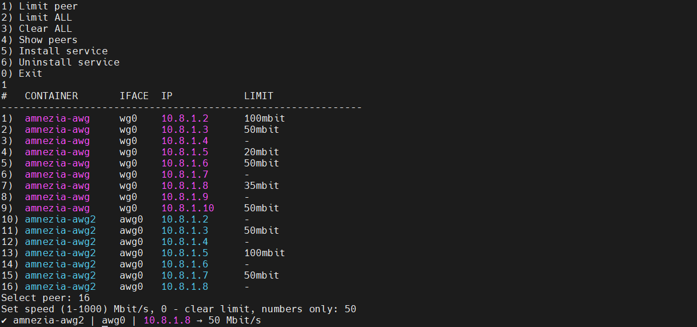

# 🚀 AmneziaWG Peers Speed Limit

[](README.md)
[](README_RU.md)

---

## ⚡ What is this?

Lightweight tool to **limit bandwidth per WireGuard peer** inside AmneziaWG Docker containers.

✔ No daemon
✔ Minimal CPU usage
✔ Designed for Amnezia VPN


---



---

## ⚡ Quick Install (Recommended)

```bash
curl -o awg-limit.sh https://raw.githubusercontent.com/404ds/awg-limit/main/awg-limit.sh
chmod +x awg-limit.sh
sudo ./awg-limit.sh
```

Then in menu:

```
5) Install service
```

---

## 📦 Full Installation (Step-by-step)

### 1. Install curl (if not installed)

```bash
apt update
apt install curl -y
```

---

### 2. Download script

```bash
curl -o awg-limit.sh https://raw.githubusercontent.com/404ds/awg-limit/main/awg-limit.sh
```

---

### 3. Make executable

```bash
chmod +x awg-limit.sh
```

---

### 4. Run script

```bash
sudo ./awg-limit.sh
```

---

### 5. Install as service

Inside menu:

```
5) Install service
```

👉 This enables auto-apply after reboot

---

## 🖥 Usage

```bash
awg-limit
```

Menu:

```
1) Limit peer
2) Limit ALL
3) Clear ALL
4) Show peers
5) Install service
6) Uninstall service
```

---

## 🧠 How it works

* Uses Linux `tc (HTB)`
* Per-peer bandwidth shaping
* No full reset on each change
* Works inside Docker containers

---

## 📊 Features

* Limit bandwidth per peer
* Limit all peers
* Remove limit using `0`
* Auto-apply after reboot (systemd)
* Multi-container support:

  * `amnezia-awg`
  * `amnezia-awg2`

---

## 🧩 Compatibility

Supports:

* [Amnezia Legacy](https://docs.amnezia.org/en/documentation/instructions/install-vpn-on-server)
* [Amnezia 2.0](https://docs.amnezia.org/en/documentation/instructions/new-amneziawg-selfhosted)

Official client:

* [Amnezia VPN client](https://github.com/amnezia-vpn/amnezia-client)

---

## 🔒 Requirements

* Linux (Ubuntu/Debian)
* Docker
* AmneziaWG installed via official client
* root / sudo access

---

## 🚧 Roadmap

Planned:

* 🤖 Telegram bot control (next)
* 📊 Real-time peer monitoring
* 📈 Traffic statistics
* ⚙️ Advanced features

---

## ⭐ Support

If this project helped you — give it a ⭐

---

## 📌 Version

v1.0
